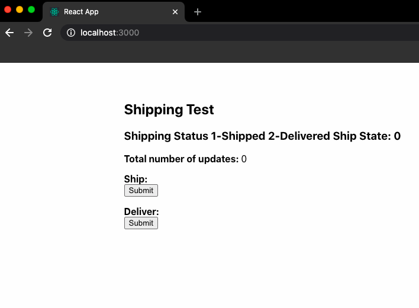

# Create a dapp for a shipping contract

Previously, the tutorial worked through a smart contract to capture the shipping status of an item. This example will wire it up to a simple DApp which lets you update the status from Pending to Shipped or Delivered. This contract now adds a counter that keeps track of the number of times the state of the shipping contract is updated and will display that in the front-end.

By starting with the code which is installed from the Drizzle box from the last example, add **Shipping.sol** to the **./contracts** folder. Modify **./migrations/2_deploy_contracts.js** add a migration for the **Shipping** contract. This is a simple example and demonstrates linking the back-end to the front end. If desired, you can update the contract and front-end and add more functionality later such as requesting to ship an item, or updating an item once it's delivered.

-   **Shipping.sol -** use the Shipping contract below.

```solidity
// SPDX-License-Identifier: MIT

pragma solidity \>=0.4.21 <0.7.0;

contract Shipping

{
    // Our predefined values for shipping listed as enums
    
    enum ShippingStatus { Pending, Shipped, Delivered }
    
    enum ShipmentStatus { Pending, Shipped, Delivered }
    
    // Save enum ShippingStatus in variable status
    
    ShippingStatus private status;
    
    ShipmentStatus public shipstatus;
    
    uint256 public numupdates;
    
    // Event to launch when package has arrived
    
    event LogNewAlert(string description);
    
    // This initializes our contract state (sets enum to Pending once the program starts)
    
    constructor() public {
    
        status = ShippingStatus.Pending;
        
        numupdates = 0;
    
    }
    
    // Function to change to Shipped
    
    function Shipped() public {
    
        status = ShippingStatus.Shipped;
        
        shipstatus = ShipmentStatus.Shipped;
        
        numupdates = numupdates + 1;
    
    }
    
    // Function to change to Delivered
    
    function Delivered() public {
    
        status = ShippingStatus.Delivered;
        
        shipstatus = ShipmentStatus.Delivered;
        
        numupdates = numupdates + 1;
        
        emit LogNewAlert("Your package has arrived");
        
    }
    
    // Function to get the status of the shipping
    
    function getStatus(ShippingStatus _status) internal pure returns
    (string memory) {
    
        // Check the current status and return the correct name
        
        if (ShippingStatus.Pending == _status) return "Pending";
        
        if (ShippingStatus.Shipped == _status) return "Shipped";
        
        if (ShippingStatus.Delivered == _status) return "Delivered";
        
    }
    
    // Get status of your shipped item
    
    function Status() public view returns (string memory) {
    
        ShippingStatus _status = status;
        
        return getStatus(_status);
        
    }

}
```

-   Modify **./migrations/2_deploy_contracts.js** is modified to include the Shipping Contract:

```javascript
        const SimpleStorage = artifacts.require("SimpleStorage");
        
        const TutorialToken = artifacts.require("TutorialToken");
        
        const ComplexStorage = artifacts.require("ComplexStorage");
        
        const Shipping = artifacts.require("Shipping");
        
        module.exports = function(deployer) {
        
            deployer.deploy(SimpleStorage);
            
            deployer.deploy(TutorialToken);
            
            deployer.deploy(ComplexStorage);
            
            deployer.deploy(Shipping);
        
        };
```

-   Start a development server using **truffle develop**. Compile and migrate the shipping contract.

    -   truffle develop

    -   truffle (develop)\> compile

    -   truffle (develop\> migrate

## Wire up the Front-End

-   Create a loading component for the Shipping contract called **./app/src/ShipComponent.js** by duplicating and renaming **./app/src/MyComponents.js**.

-   Modify the loading container with the methods in the Shipping contract.

```jsx
import React from "react";

import { newContextComponents } from "@drizzle/react-components";

const { AccountData, ContractData, ContractForm } =newContextComponents;

export default ({ drizzle, drizzleState }) => {
    return (
        <div className="App">
            <div className="section">
            
                <h2>Shipping Test</h2>
                
                <h3>
                    <strong>Shipping Status 1-Shipped 2-Delivered </strong>
                    
                    <strong>Ship State: </strong>
                    
                    <ContractData
                        drizzle={drizzle}
                        drizzleState={drizzleState}
                        contract="Shipping"
                        method="shipstatus"
                    \>
                </h3>

                <p>
                    <strong>Total number of updates: </strong>
                    
                    <ContractData
                        drizzle={drizzle}
                        drizzleState={drizzleState}
                        contract="Shipping"
                        method="numupdates"
                    />
                </p>
                
                <p>
                    <strong>Ship: </strong>

                    <ContractForm    
                        drizzle={drizzle}
                        contract="Shipping"
                        method="Shipped"
                    />
                </p>

                <p>    
                    <strong>Deliver: </strong>
                    
                    <ContractForm
                        drizzle={drizzle}
                        contract="Shipping"
                        method="Delivered"
                    />
                </p>
            </div>
        </div>
    )
}
```
-   **./app/src/drizzleOptions.js** also remains largely unchanged, but needs to import **Shipping.json.**

```jsx
import Web3 from "web3";

import ComplexStorage from "./contracts/ComplexStorage.json";

import SimpleStorage from "./contracts/SimpleStorage.json";

import TutorialToken from "./contracts/TutorialToken.json";

import Shipping from "./contracts/Shipping.json";

const options = {
    web3: {
        block: false,
        customProvider: new Web3("ws://localhost:8545"),    
    },
    
    contracts: [SimpleStorage, ComplexStorage, TutorialToken,Shipping],
    
    events: {
        SimpleStorage: ["StorageSet"],
    },
};

export default options;
```

-   **Modify ./app/src/App.js** and replace **MyComponent** with **ShipComponent**:

```jsx
import React from "react";
import { DrizzleContext } from "@drizzle/react-plugin";
import { Drizzle } from "@drizzle/store";
import drizzleOptions from "./drizzleOptions";
import ShipComponent from "./ShipComponent";
import "./App.css";

const drizzle = new Drizzle(drizzleOptions);

const App = () => {
    return (
    <DrizzleContext.Provider drizzle={drizzle}>
        <DrizzleContext.Consumer> {
                drizzleContext => {
                    const { drizzle, drizzleState, initialized } = drizzleContext;
                    
                    if (!initialized) {
                        return "Loading..."                
                    }
                
                    return (
                        <ShipComponent drizzle={drizzle} drizzleState={drizzleState} />                    
                    )
                }
            }
        </DrizzleContext.Consumer>
    </DrizzleContext.Provider>
    );
}

export default App;
```

## Run the Shipping Example Code

The above steps walk through getting started, compiling and migrating the **Drizzle Box** tutorial. Open a new terminal window, and from the **./app** folder start up a local browser using this commands:

-   cd app

-   npm rebuild

-   npm run start

This command starts the web-pack dev server for React and opens up a new browser window for the React project which should result in the image below. Once this has been tested, close it by either closing the terminal window or \<ctrl-c\>. This confirms that react was correctly installed. React starts a web browser on [http://localhost:3000](http://localhost:3000) and automatically opens a browser window.

If you have MetaMask installed, you may need to close and re-open [http://localhost:3000](http://localhost:3000) from an incognito browser window.

You should see the following. In this dapp, you can now interact with the contracts directly.


